# Klaytn-DEX User Guide <!-- omit in toc -->

With the help of this guide, you will learn how to use the Klaytn-DEX to perform all available actions on the blockchain, such as connect your wallet, swap tokens, farm and stake LP tokens, and so on. We will start by introducing the basic concepts used throughout the guide, and then walk you through all available functionality.

## Introduction <!-- omit in toc -->

Klaytn-DEX works with ERC-20 or KIP7 tokens. 

### Token Swap
Token swaps in Dex are a simple way to trade one ERC-20 or KIP7 token for another. Each pair of tokens on Dex is underpinned by a liquidity pool.

### Liquidity Pool

Liquidity pools are smart contracts that hold balances of two unique tokens and enforce rules on depositing and withdrawing them.

## Available Operations <!-- omit in toc -->

The guide covers the following operations available on Klaytn-DEX:

- [Connect Wallet](#connect-wallet)
- [Swap](#swap)
  - [Issues](#issues)
  - [Swap Preferences](#swap-preferences)
    - [Multi-hops](#multi-hops)
    - [Expert mode](#expert-mode)
- [LP Provision](#lp-provision)
  - [Add liquidity](#add-liquidity)
  - [Remove liquidity](#remove-liquidity)
- [Farming](#farming)
  - [View farming pools](#view-farming-pools)
  - [Expand details about a farming pool](#expand-details-about-a-farming-pool)
  - [Calculate ROI (farming)](#calculate-roi-farming)
  - [Sort farming pools](#sort-farming-pools)
  - [Stake LP tokens](#stake-lp-tokens)
  - [Add or remove staked LP tokens](#add-or-remove-staked-lp-tokens)
  - [Withdraw earned DEX tokens](#withdraw-earned-dex-tokens)
- [Staking](#staking)
  - [View staking pools](#view-staking-pools)
  - [Expand details about a staking pool](#expand-details-about-a-staking-pool)
  - [Calculate ROI (staking)](#calculate-roi-staking)
  - [Sort staking pools](#sort-staking-pools)
  - [Stake tokens](#stake-tokens)
  - [Add or remove staked tokens](#add-or-remove-staked-tokens)
  - [Withdraw earned tokens](#withdraw-earned-tokens)
- [Dashboard](#dashboard)
  - [View all pools](#view-all-pools)
  - [View pool info](#view-pool-info)
  - [View all tokens](#view-all-tokens)
  - [View token info](#view-token-info)
- [Governance](#governance)
  - [View proposals](#view-proposals)
  - [Vote](#vote)

## Connect Wallet

The first thing you need to do is to connect your wallet to DEX. DEX works with two wallets: Metamask and Kaikas. You have to have a wallet in either of those to be able to work with DEX.

0. Install Chrome extension for [Metamask](https://chrome.google.com/webstore/detail/metamask/nkbihfbeogaeaoehlefnkodbefgpgknn) or [Kaikas](https://chrome.google.com/webstore/detail/kaikas/jblndlipeogpafnldhgmapagcccfchpi) and create a wallet.

1. Open DEX. In the upper right corner, you will find a `Connect Wallet` button.
   
   Depending on which extensions you installed and which wallets you have, you will see the available options for connecting a wallet. For example, if you have a Kaikas wallet but not a Metamask one, this is what you will see:

   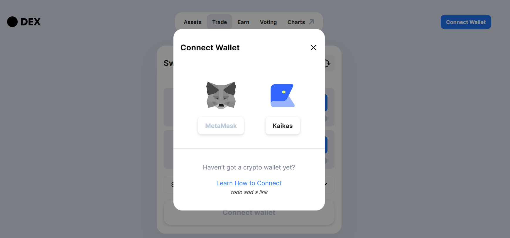

2. Choose a wallet to connect to DEX.
   If you haven't already, add the Klaytn Baobab Testnet to your wallet:
   - **Network Name**: Klaytn Testnet
   - **New RPC URL**: https://api.baobab.klaytn.net:8651
   - **Chain ID**: 1001
   - **Currency Symbol**: KLAY
   - **Block Explorer URL**: https://baobab.scope.klaytn.com

3. Agree to conditions and confirm that you trust the website:
   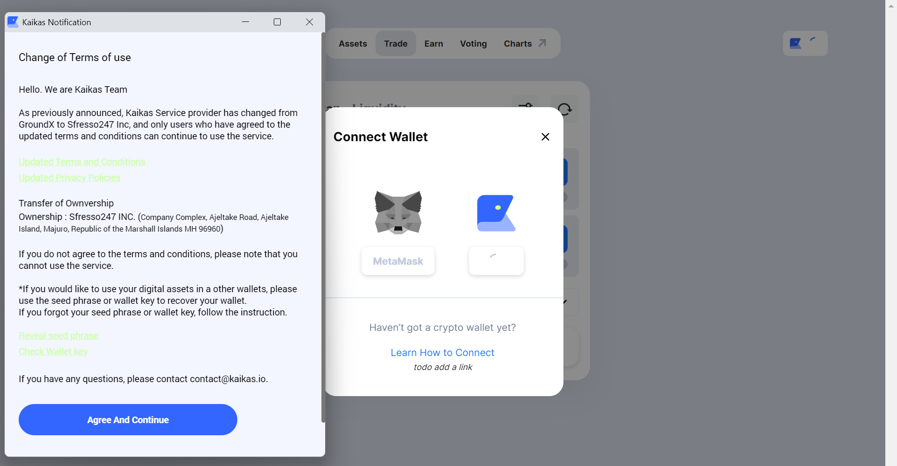
   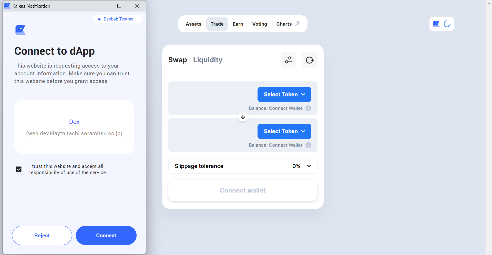

Once you have connected a wallet, you will see its information displayed in the upper right corner. The wallet address and balance are displayed:

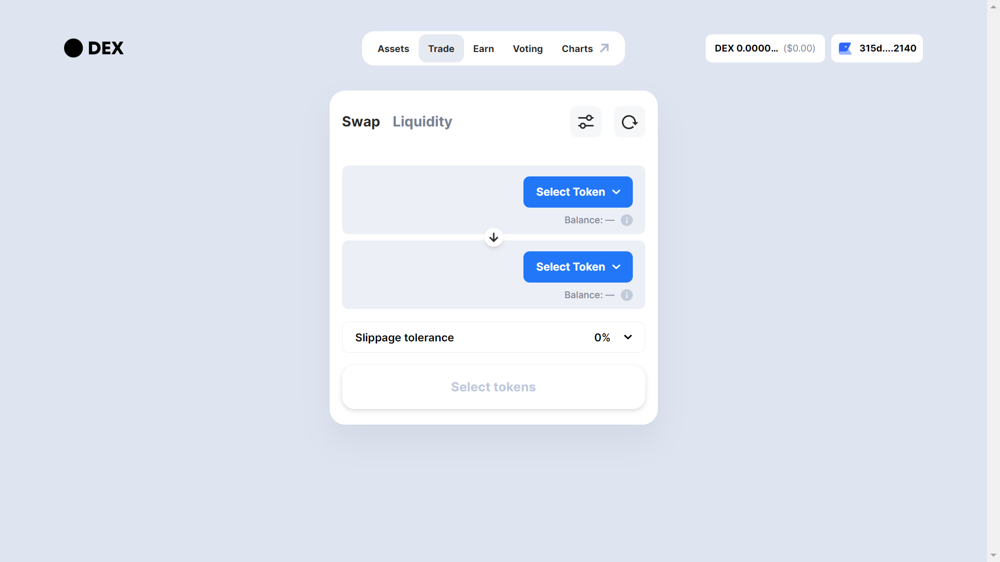

## Swap

You can swap tokens in the `Trade`>`Swap` tab.

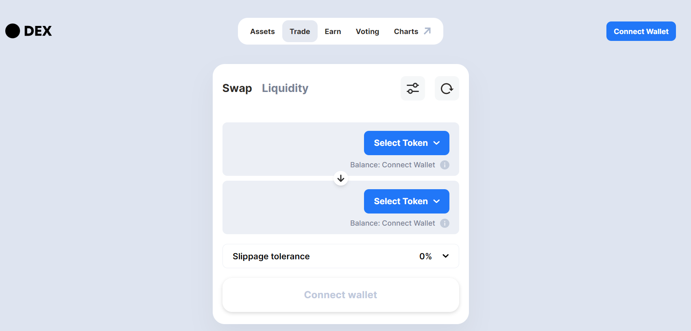

1. Select the pair of tokens you want to swap:

   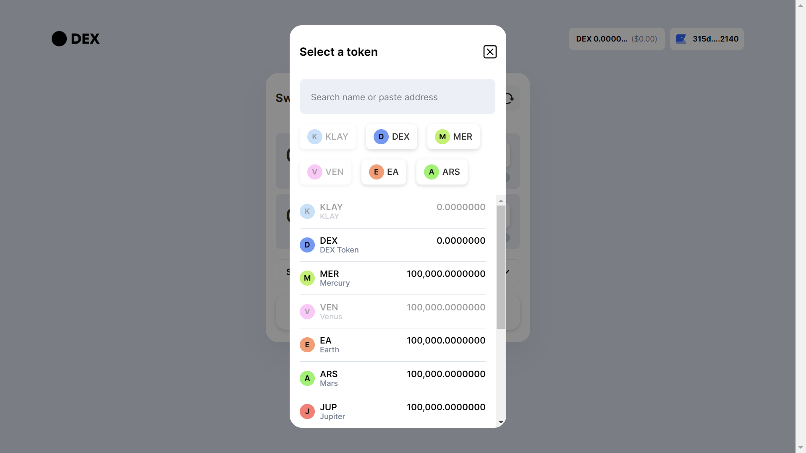

2. Put in the amount of tokens to swap. When you put a value in either of the boxes, the value for the other token will be calculated automatically:

   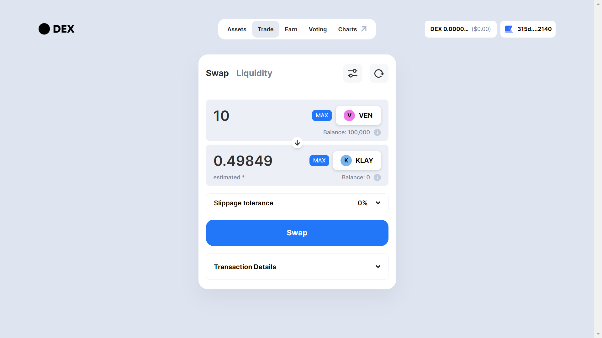

3. Set the slippage tolerance (the percentage of the total swap value you can tolerate losing due to the difference in actual price and the price at confirmation time). To do this, expand `Slippage tolerance` section and choose the percentage. For example, here we've chosen `0.5%`:

   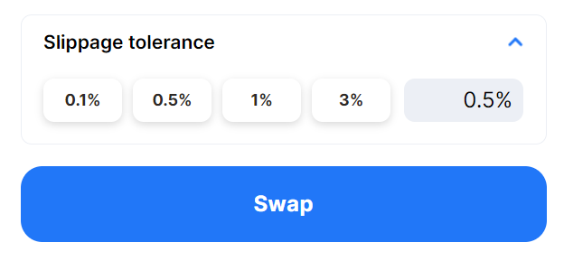

   Note that the lesser the tolerance, the greater the chance that the transaction will fail. Dex will warn you about this.

   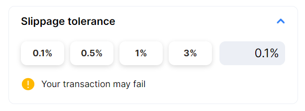

4. Expand `Transaction Details` to view the transaction details such as the price impact or the minimum amount of tokens you will receive.
  
   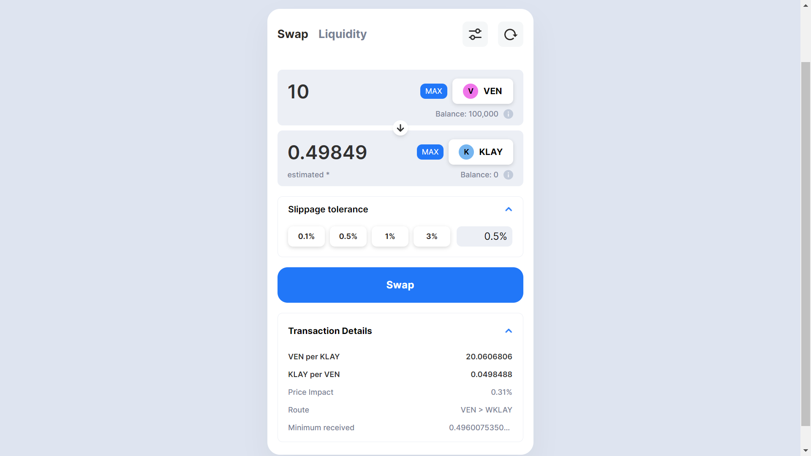

5. If you agree to the conditions of the transaction, press `Swap` and confirm the swap.

   <!-- confirmation screenshot-->

### Issues

You can face the following issues during the swap:

- Insufficient amount of tokens.
  
  If the amount of tokens you want ot swap is higher than what you have in your wallet, you won't be able to perform the swap.

  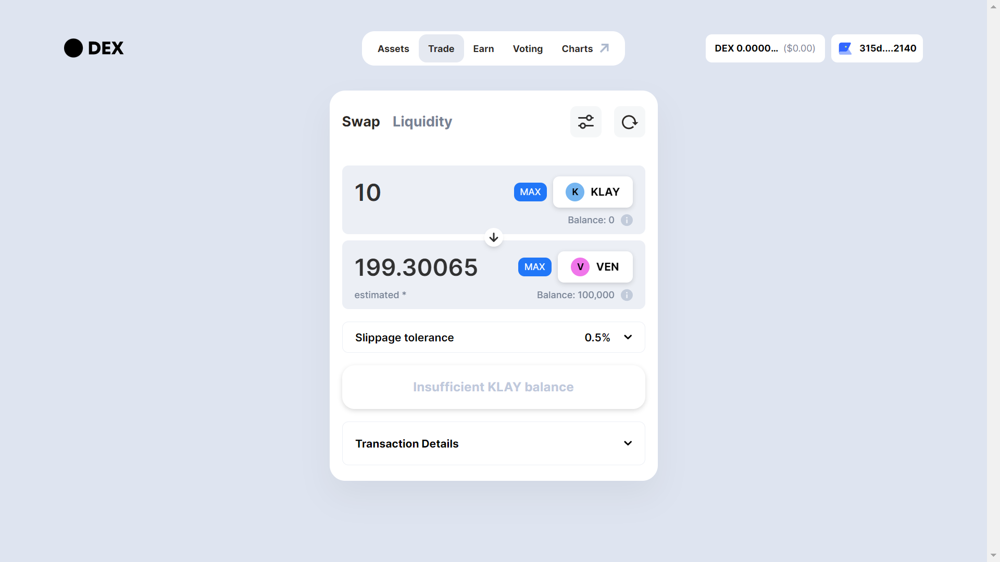

- Not enough KLAY for transaction fee.
  
  If you don't have enough KLAY tokens in your wallet, you will see this error after pressing `Swap`. You won't be able to confirm the transaction unless you have enough KLAY to pay the fee.

- Route between the pair of tokens is not found.
  
  Enable [multi-hops](#multi-hops) in the swap preferences to be able to swap a pair of tokens that doesn't have a liquidity pool.

### Swap Preferences

If you press the settings icon, you will see swap settings (enabling multi-hops and expert mode):

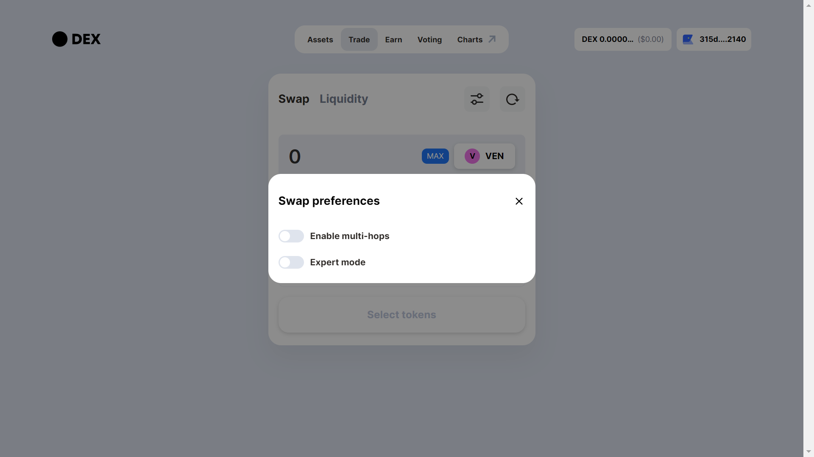

#### Multi-hops

If you enable multi-hops, you will be able to swap tokens that don't have a [liquidity pool](#liquidity-pool) for their pair.

Note the differences in route for two following swap operations:

- If multi-hops are disabled, there is no route between `VEN` and `DEX`:

  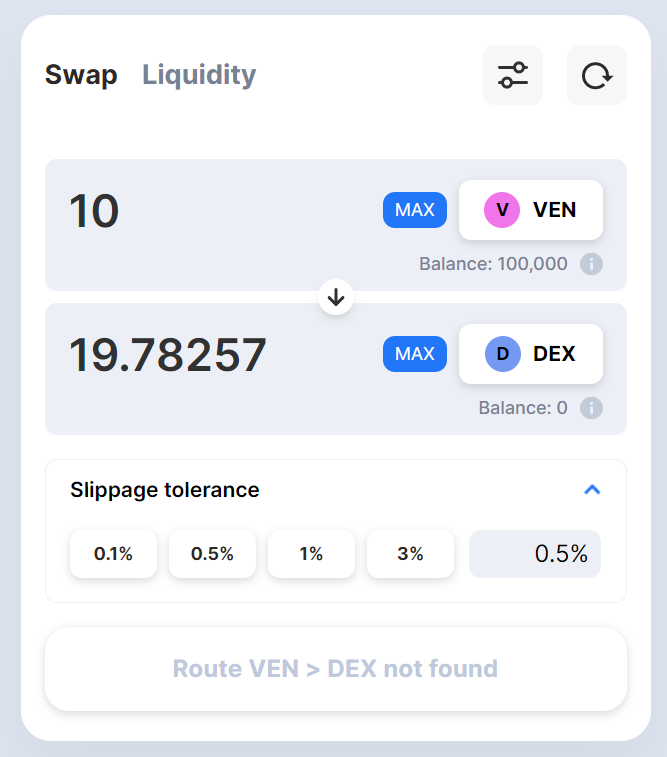

- If multi-hops are enables, there is a route between `VEN` and `DEX` through multiple other pairs:

  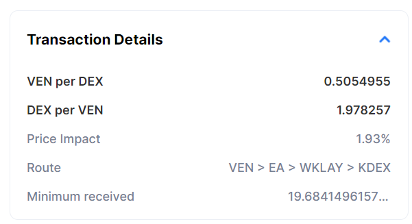

#### Expert mode

In expert mode, you only need to confirm access to the token once. After that it will be available for all future operations.

## LP Provision

Liquidity pools are smart contracts that hold balances of two unique tokens and enforce rules on depositing and withdrawing them.

Liquidity pools contain LP tokens. When you add liquidity to a liquidity pool, you receive LP tokens. When you remove liquidity, you remove LP tokens from the pool.

You can add and remove liquidity in the `Trade`>`Liquidity` tab:

- If you haven't joined any pool, you will only be able to add liquidity:

  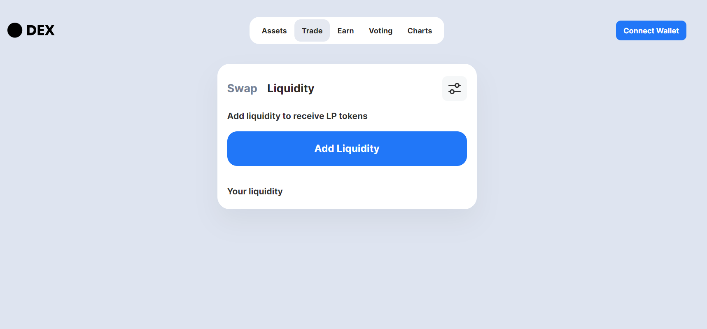

- If you already joined pools, you will see their information as well: 

  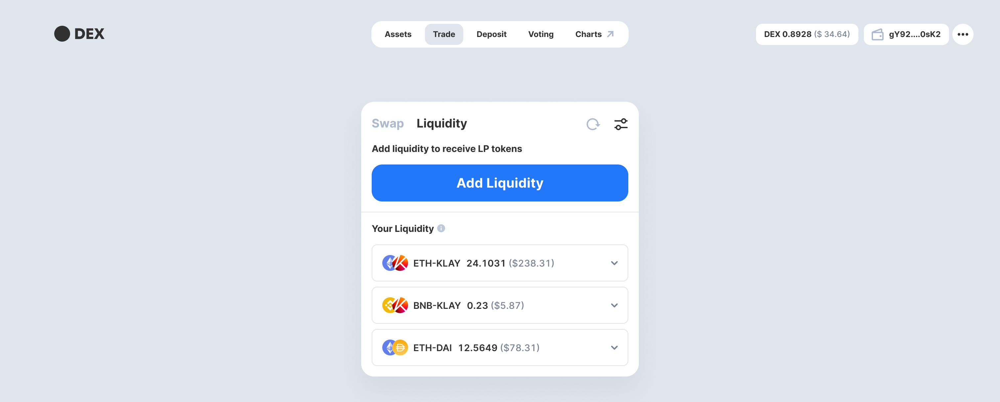

### Add liquidity

1. In the `Trade`>`Liquidity` tab, press `Add Liquidity`.

2. Select the pair of tokens:

   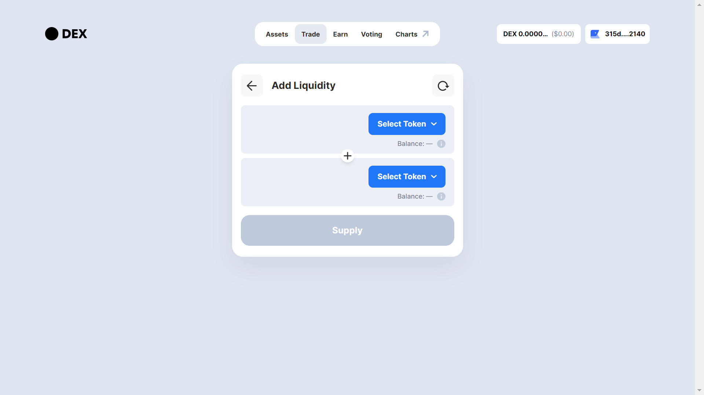

3. Choose the pair of tokens for which you want to add liquidity. Note that for some pairs the pool already exists and for some it doesn't.
   
   - **The pool already exists for the pair of tokens you've chosen**: in this case, when you specify the amount of tokens to add for any of the tokens, the value for the second token will be calculated automatically:

   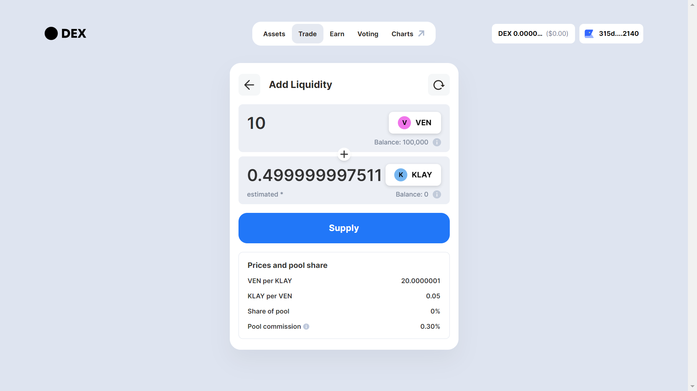

   The pool commission shows which percentage you will earn from all trades on this pair (proportional to your share).

   - **The pool doesn't exist for the pair of tokens you've chosen**: in this case, DEX will notify you that by adding liquidity for this pair of tokens you will be creating a new pool:

     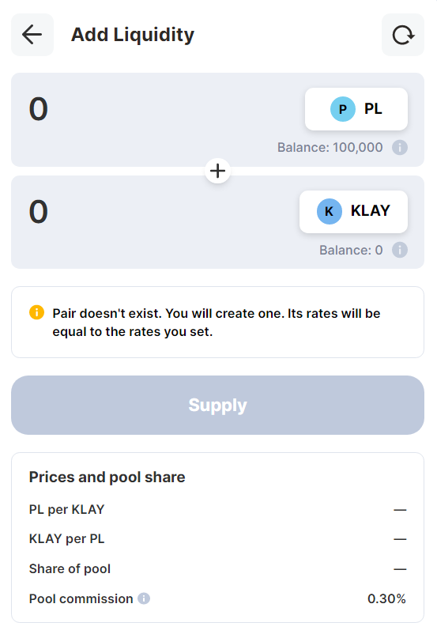

    When you specify the amount of tokens to add, you are also setting the rates for this pool:

    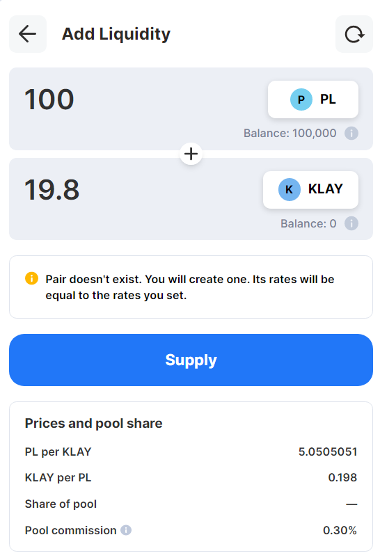

4. Confirm supply.

### Remove liquidity

1. In the `Trade`>`Liquidity` tab, choose the pool from which you want to remove LP tokens.

2. Move slider to indicate how much tokens you want to remove.

   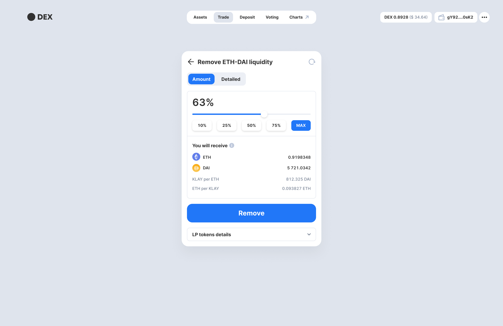

   Alternatively, you can also switch to the `Detailed` tab to put in the exact values.

   <!-- screenshot -->

3. Press `Remove`. You will see the details of the transaction.

<!-- screenshot -->

4. Confirm remove.

<!-- screenshot? -->

<!--

### Find LP tokens

-->

## Farming

You can farm tokens in the `Earn`>`Farms` tab.

- [View farming pools](#view-farming-pools)
- [Expand details about a farming pool](#expand-details-about-a-farming-pool)
- [Calculate ROI (farming)](#calculate-roi-farming)
- [Sort farming pools](#sort-farming-pools)
- [Stake LP tokens](#stake-lp-tokens)
- [Add or remove staked LP tokens](#add-or-remove-staked-lp-tokens)
- [Withdraw earned DEX tokens](#withdraw-earned-dex-tokens)

### View farming pools

On the `Earn`>`Farms` page, you will see the full list of farming pools. Switch `Staked only` button to view only the pools in which you have staked LP tokens.

The pool icon and name indicate the pair of LP tokens. For each pool, you are shown:
- how much tokens you have earned
- the annual percentage rate (APR) for the pool
- liquidity of the pool
- pool multiplier

### Expand details about a farming pool

If you click on a pool, you will see more information about it. You will see how much LP tokens you've staked and how much DEX tokens you've earned.

You will also be able to:

- Change the amount of staked LP tokens
- Withdraw earned DEX tokens
- See information about the token pair on KlaytnFinder
- View contract on KlaytnFinder

### Calculate ROI (farming)

Click on the calculator icon next to the APR value to open ROI calculator:

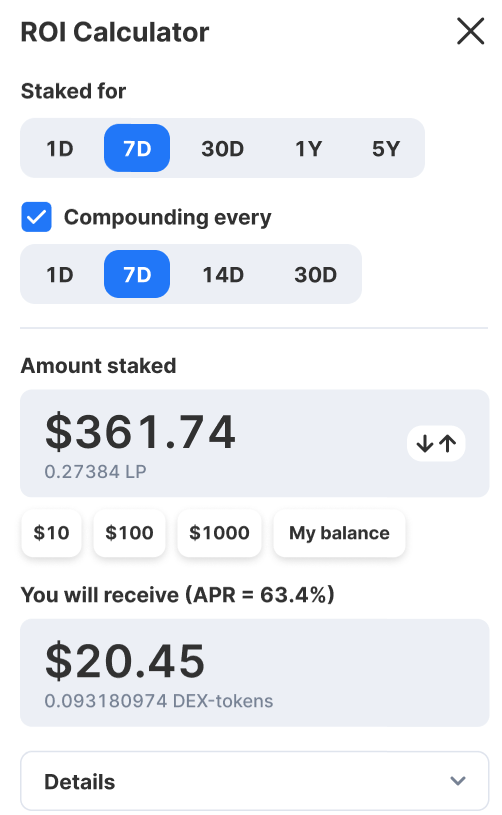

To calculate how much you will earn, specify the time period for which the tokens will be staked, how often to compound the earnings, and pick the amount of LP tokens to stake. The calculator will show you how much you will earn based on these conditions.

Expand the details section to see APR (annual percentage rate) including LP rewards, base APR, and APY (annual percentage yield):

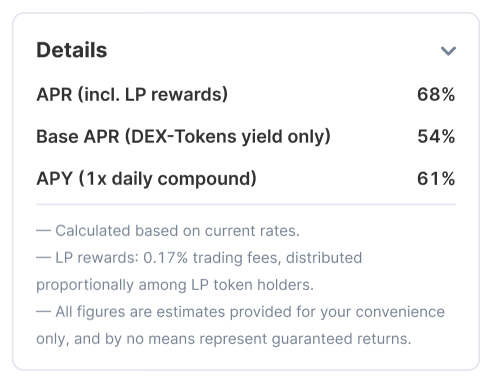

### Sort farming pools

You can sort pools on the page:

- `Hot`: show open pools with the most APR first
- `Liquidity`: sort pools by their liquidity
- `APR`: sort pools by their annual percentage rate
- `Multiplier`: sort pools by their multiplier
- `Earned`: sort pools by how much you have earned in them
- `Latest`: show the newly created pools first

### Stake LP tokens

1. Choose the pool in which to stake tokens and click on it.

   Note that if you don't have the LP tokens that are being staked in this pool, you will need to [get](#add-liquidity) them first.

     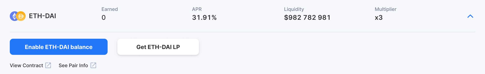

2. Stake LP tokens and confirm the operation:

     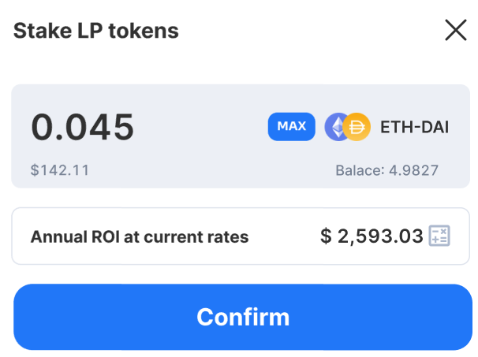

### Add or remove staked LP tokens

When you already have LP tokens staked in the pool, you will be able to stake additional LP tokens and unstake LP tokens.

1. Click on the pool:

   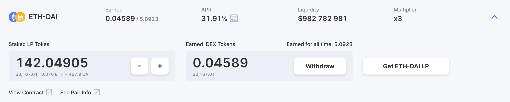

2. Choose whether to add or remove LP tokens:

   - To stake additional LP tokens, click `+`.
   - To unstake LP tokens, click `-`.

   Note that you can only add more LP tokens if you have any.

### Withdraw earned DEX tokens

1. Click on the pool:

   

2. Press `Withdraw` to withdraw earned tokens and confirm the operation.

## Staking

You can stake tokens in the `Earn`>`Pools` tab.

- [View staking pools](#view-staking-pools)
- [Expand details about a staking pool](#expand-details-about-a-staking-pool)
- [Calculate ROI (staking)](#calculate-roi-staking)
- [Sort staking pools](#sort-staking-pools)
- [Stake tokens](#stake-tokens)
- [Add or remove staked tokens](#add-or-remove-staked-tokens)
- [Withdraw earned tokens](#withdraw-earned-tokens)

### View staking pools

On the `Earn`>`Pools` page, you will see the full list of staking pools. Switch `Staked only` button to view only the pools in which you have staked tokens.

The pool icon and name indicate which token is staked and which token is earned. For each pool, you are shown:
- how much tokens you have earned
- the USD equivalent of the total amount of tokens staked in this pool
- the annual percentage rate (APR) for the pool
- when the pool ends

### Expand details about a staking pool

If you click on a pool, you will see more information about it. You will see how much you've staked and earned.

You will also be able to:

- Change the amount of staked tokens
- Withdraw earned tokens
- See information about the token on KlaytnFinder
- View contract on KlaytnFinder
- Add the token to your wallet

### Calculate ROI (staking)

Click on the calculator icon next to the APR value to open ROI calculator:

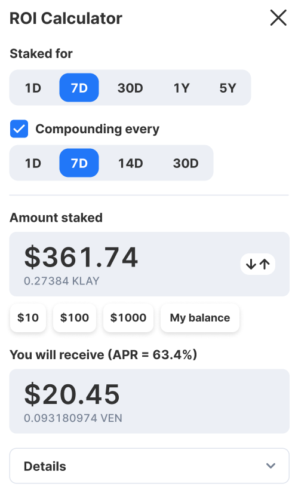

To calculate how much you will earn, specify the time period for which the tokens will be staked, how often to compound the earnings, and pick the amount to stake. The calculator will show you how much you will earn based on these conditions.

Expand the details section to see APR (annual percentage rate) and APY (annual percentage yield):

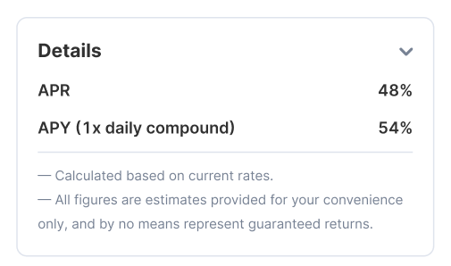

### Sort staking pools

You can sort pools on the page:

- `Hot`: show open pools with the most APR first
- `APR`: sort pools by their annual percentage rate
- `Earned`: sort pools by how much you have earned in them
- `Total staked`: sort pools by how much is staked in them 
- `Latest`: show the newly created pools first

### Stake tokens

1. Choose the pool in which to stake tokens and click on it.

   - If you don't have the tokens that are being staked in this pool, you will need to [get](#swap) them first.

     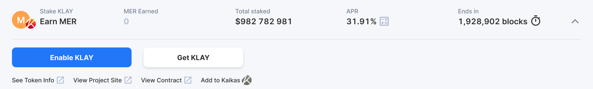

   - If you have the tokens that are being staked in this pool, you will see the stake button (e.g., `Stake KLAY` for the `KLAY` token):

     

2. After clicking the stake button, you need to specify how much of your tokens you'd want to stake and confirm staking:

   

### Add or remove staked tokens

You can change the number of staked tokens by pressing either the `+` to add tokens or `-` to remove tokens from the staking pool:

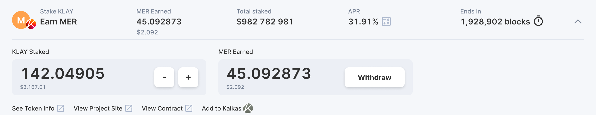

Note that you can only add more tokens if you have any.

### Withdraw earned tokens

Click `Withdraw` to withdraw the tokens you have earned:

## Dashboard

Go to the `Charts` tab to view DEX dashboard. You will land on the `Overview` page, where you can find the graphs showing the changes in total value locked (TVL) and 24-hour volume by days, weeks, or months. This page also features top tokens, top pools, and the latest transactions in DEX.

### View all pools

You can view top pools on the `Overview` page. From there, click `All pools` to see the full list of pools. Alternatively, you can go to the `Pools` tab at the top of the page.

### View pool info

Click on a pool to view the detailed information about it. The page for each pool features the list of transactions for this pool and a graph like this:

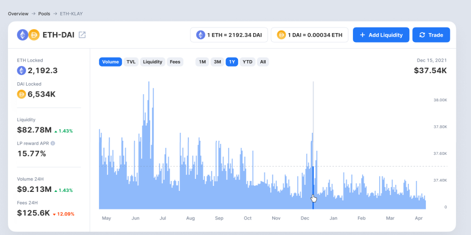

Depending on the settings, it can show you the changes in volume, total value locked (TVL), liquidity, or fees. You can also specify the time period, e.g. a month or year.

From this overview page, you can go directly to this pool on DEX, trade, or [add liquidity](#add-liquidity).

### View all tokens

You can view top tokens on the `Overview` page. From there, click `All tokens` to see the full list of pools. Alternatively, you can go to the `Tokens` tab at the top of the page.

### View token info

Click on a token to view the detailed information about it.

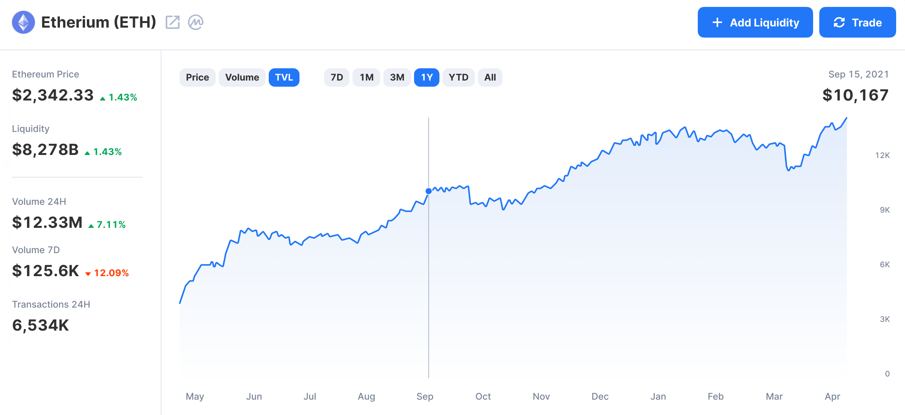

Depending on the settings, it can show you you the changes in price, volume, or total value locked (TVL). You can also specify the time period, e.g. a month or year.

## Governance

You can view proposals and vote for them.

### View proposals

In the `Voting` tab you can view all proposals: active, executed, defeated, finished. For each proposal, you see its start and end dates, title, and status.

To show only active proposals, switch `Only Active` button in the upper left corner. You can also filter proposal either by their start date or end date.

To view details of a proposal, click on it, and you will be taken to the page that contains the detailed description of the proposal.

### Vote

* Kaikas Wallet users can't vote on the current version of Dex

Once you navigate to a proposal page, at the top of the page you will find the `Vote` button and the available voting options.

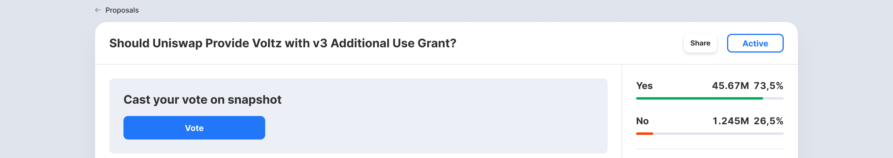

Click `Vote`. You will be taken to snapshot where you can cast your vote.
